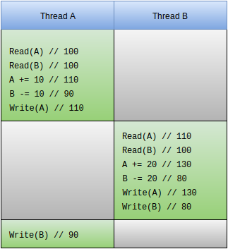
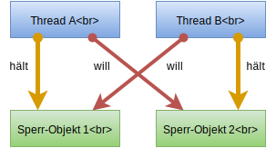

:data-transition-duration: 2000
:skip-help: true
:css: css/campus02.css

.. title: Multithreading in Java

.. role:: java(code)
   :language: java

----

Multithreading in Java
======================

----

Agenda
------

 * Einführung in Multithreading

  * Was sind Threads
  * Warum Threads

 * Implemetierungen in Java
 * Verwalten von Threads
 * Synchronisation
 * Deadlocks

----

Was sind Threads?
=================

* Parallele Ausführungsstränge innerhalb eines Prozesses
* Nutzen Daten eines Prozesses
* Sind "leichtgewichtiger" und somit einfacher zu erzeugen als ein Prozess
* Thread-Wechsel ist nicht vorhersehbar

----

Warum Threads?
==============

* Hintergrundprozesse
* Usability
* Ausnutzung von CPUs/ Kernen

----

Threads in Java
===============

Von :java:`Thread` ableiten und :java:`run()` implementieren:

.. code:: java

  public class MyThread extends Thread {

    @Override
    public void run() {
      /* Code */
    }

  }

.. code:: java

  public static void main(String[] args) {
    MyThread t = new MyThread();
    t.start();
  }

----

Threads in Java
===============

Interface :java:`Runnable` implementieren und an :java:`Thread` übergeben:

.. code:: java

  public class MyRunnable implements Runnable {

    @Override
    public void run() {
      /* Code */
    }

  }

.. code:: java

  public static void main(String[] args) {
    Thread t = new Thread(new MyRunnable());
    t.start();
  }

----

Übung: Zwei Threads
===================

Implementieren Sie einen :java:`Thread`, der alle 200 Millisekunden einen
Buchstaben ausgibt.

Benutzen Sie für das Timing :java:`Thread.sleep(200)`. Diese Methode pausiert
die Ausführung eines Threads für die angegebene Anzahl an Millisekunden.

----

Threads verwalten
=================

Threads stoppen sich selbst, wenn ihre :java:`run()` Methode beendet ist. Sollte
ein vorzeitiger Abbruch des Threads gewünscht sein, so muss dies im Ablauf von
:java:`run()` berücksichtigt werden.

----

Beispiel: "Höfliches" Stoppen
=============================

.. code:: java

  public class Worker implements Runnable {

    private boolean isRunning = true;

    public void requestShutDown() {
      isRunning = false;
    }

    @Override
    public void run() {
      while( isRunning ) {
        /* Code */
      }
    }
  }

----

Beispiel: "Unhöfliches" Stoppen
===============================

.. code:: java

  Thread t = new MyThread();
  t.start();
  Thread.sleep(1000);
  t.stop();

* Beendet den :java:`Thread` *gewaltsam*
* Ist **deprecated**: Kann in künftigen Java-Versionen entfallen
* Allerdings: Keine wirkliche Alternative

----

Beispiel: Kombiniertes Stoppen
==============================

.. code:: java

  Thread t = new MyThread();
  t.start();
  t.requestShutDown();
  t.join(5000); // 5 Sekunden
  t.stop();

----

Synchronisation
===============

Wird für **kritische Sektionen** benötigt. Dies sind Codebereiche, die **nicht
gleichzeitig von mehreren Threads** ausgeführt werden dürfen, weil sich die
Threads "ansonsten in die Quere kommen würden".

----

Was passiert hier?
==================

----

Beispiel: Synchronized
======================

.. code:: java

  private static Object lock = new Object();

  public void run() {
    /* Unkritischer Code */
    synchronized(lock) {
      /* Kritischer Codde */
    }
    /* Unkritischer Code */
  }

Währende der :java:`synchronized`-Block ausgeführt wird, darf kein anderer
Thread, der sich auf das selbe **Sperr-Objekt** bezieht, diesen betreten.

Jedes Objekt kann ein Sperr-Objekt sein.

----

Beispiel: Synchronisierte Methoden
==================================

Eine Methode mit dem :java:`synchronized`-Schlüssewort ...

.. code:: java

  public synchronized void doStuff() {
    /* Kritische Sektion = Ganze Methode */
  }

... ist das selbe wie eine Methode, bei der der gesamte Code in einem
:java:`synchronized`-Block verpackt ist.

.. code:: java

  public void doStuff() {
    synchronized(this) {
      /* Kritische Sektion = Ganze Methode */
    }
  }

----

Deadlocks
=========

Ein Problem bei Synchronisation können sogenannte Deadlocks (Verklemmungen) darstellen.

Dabei sperren sich **zwei oder mehrere Threads** gleichzeitig von benötigten
Ressourcen aus. **Thread A** wartet darauf, dass **Thread B** eine Ressource
freigibt. Gleichzeitig wartet aber **Thread B**, dass **Thread A** seine
gesperrte Ressource freigibt.

----

Schema: Deadlock
================

----

Beispiel: Verbeugungen
======================

Zwei Freunde (Klasse :java:`Friend`) sind besonders auf Höflichkeit bedacht.
Beide verbeugen (:java:`synchronized bow()`) sich dem Anderen gegenüber und
dieser erwiedert (:java:`synchronized bowBack()`) die Verbeugung.

Implementieren Sie die Klasse :java:`Friend` und ihre Methoden als
:java:`Runnable`. Lassen Sie zwei Threads mit diesen Klassen laufen und
beobachten Sie ihr Verhalten.
